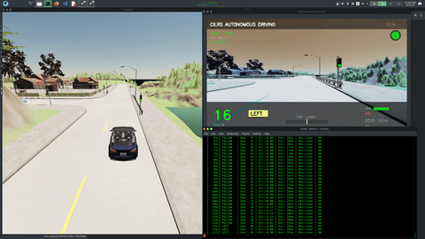
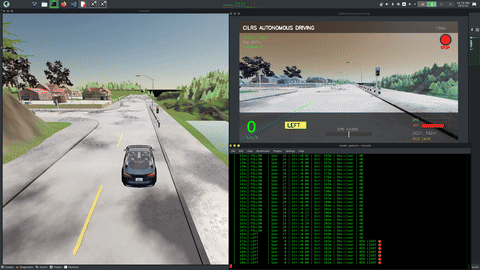
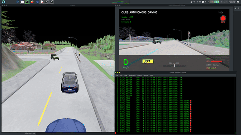
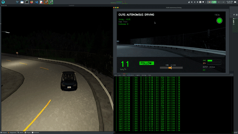
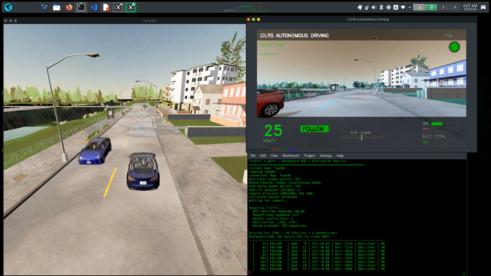
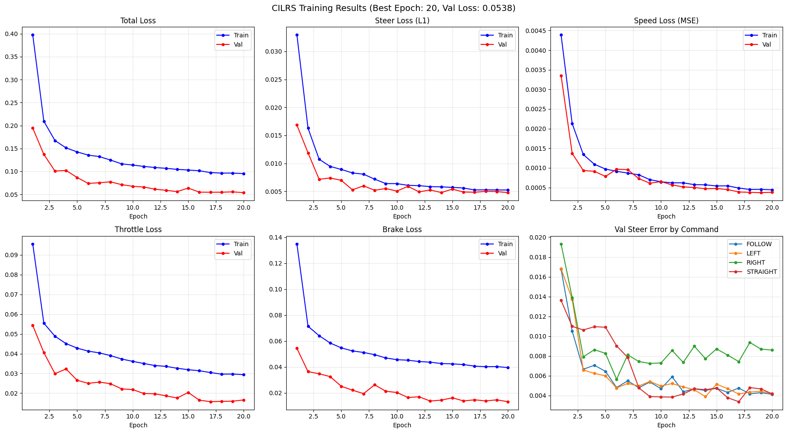
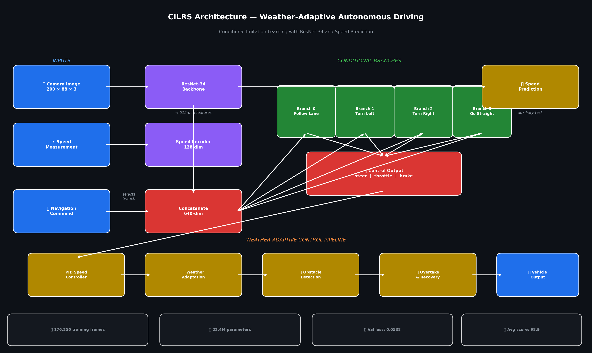

<div align="center">

# 🚗 CILRS Autonomous Driving in CARLA

**B.Tech CSE Major Project — End-to-end conditional imitation learning for self-driving vehicles
with weather-adaptive control and real-world map integration**

[](https://python.org)
[](https://pytorch.org)
[](https://carla.org)
[](LICENSE)

[▶️ Demo](#-demo) • [📊 Results](#-results) • [📈 Training](#-training-results--loss-curves) • [🏗️ Architecture](#-architecture) • [🚀 Quick Start](#-quick-start) • [🗺️ CUSAT Map](#-custom-map--cusat-campus) • [📝 References](#-references)

</div>

---

## 🎯 Highlights

- **A+ grade across ALL 5 weather conditions** with zero collisions
- **22.4M parameter CILRS model** (ResNet-34 backbone) trained on 176K frames
- **Weather-adaptive driving**: dynamic speed, braking, and steering per condition
- **Full safety suite**: traffic light detection, obstacle avoidance, overtake/reverse state machine, stuck recovery
- **Tesla-style live Dashboard HUD** with real-time speed, controls, obstacle warnings, and scoring
- **Real-world map integration**: CUSAT University campus via OSM → OpenDRIVE pipeline *(experimental)*

---

## 📊 Results

<div align="center">

| Weather | Grade | Score | Collisions | Destination | Time | Max Speed |
|:-------:|:-----:|:-----:|:----------:|:-----------:|:----:|:---------:|
| ☀️ Clear | **A+** | 99.4 | 0 | ✅ | 4.8 min | 35.5 km/h |
| 🌧️ Rain | **A+** | 98.7 | 0 | ✅ | 6.4 min | 28.7 km/h |
| 🌫️ Fog | **A+** | 99.3 | 0 | ✅ | 6.1 min | 30.5 km/h |
| 🌙 Night | **A+** | 99.3 | 0 | ✅ | 6.2 min | 25.7 km/h |
| ⛈️ Hard Rain | **A+** | 97.8 | 0 | ✅ | 5.6 min | 21.1 km/h |

**Average Score: 98.9 | Zero Collisions Across All Conditions**

</div>

### Scoring Formula

```
Overall  = Safety × 0.6  +  Comfort × 0.3  +  Route Completion × 0.1
Safety   = 100 − (collisions × 15) − (red_light_violations × 10) − (off_road% × 40)
Comfort  = 100 − (avg_steering_jerk × 1000)
```

### Model Training Metrics

| Metric | Value |
|--------|-------|
| Validation Loss | 0.0538 |
| Steering Correlation | **0.9861** |
| Throttle Correlation | 0.9589 |
| Brake Correlation | 0.9815 |
| Speed Correlation | 0.9844 |

---

## 🎬 Demo

<div align="center">

| Clear Weather | Rain | Hard Rain |
|:---:|:---:|:---:|
|  |  |  |

| Fog | Night | Dashboard HUD |
|:---:|:---:|:---:|
|  |  |  |

</div>

### ▶️ Full Weather Demo on YouTube

[](https://youtu.be/EKpgvofZYiw)

> All 5 weather conditions in a single continuous run — [**Watch on YouTube →**](https://youtu.be/EKpgvofZYiw)

---

## 📈 Training Results — Loss Curves

*Trained on Kaggle, NVIDIA T4 GPU*



All six plots show healthy convergence — validation loss consistently tracks below training loss from epoch 3 onwards with no signs of overfitting. The **Val Steer Error by Command** panel (bottom-right) confirms balanced performance across all four navigation branches (Follow, Left, Right, Straight), with per-branch errors converging below 0.005 by epoch 15.

### Training Configuration

| Parameter | Value |
|-----------|-------|
| Epochs | 20 |
| Batch Size | 128 |
| Learning Rate | 0.0002 |
| Optimizer | Adam (weight_decay = 1e-4) |
| Loss — Controls | MSE |
| Loss — Speed | MSE (auxiliary head) |
| GPU | NVIDIA T4 (Kaggle) |
| Total Frames | 176,256 (5 sessions) |
| Input Resolution | 200×88 RGB |

### Training Pipeline

1. **Collect** — Drive manually in CARLA Town01 using `collect_data.py`; saves raw frames + `measurements.csv`
2. **Prepare** — Run `prepare_dataset.py` to resize 800×600 → 200×88 and organise sessions
3. **Train** — Run `notebook/notebook.ipynb` on Kaggle T4
4. **Deploy** — Load `checkpoint_best.pth` in `autonomous_drive.py` for inference

---

## 🏗️ Architecture

<div align="center">



</div>

### CILRS Model

```
Camera Image (200×88×3)
        │
  ResNet-34 Backbone
        │
  512-dim visual features ───────────────────────┐
        │                                         │
        │                           Speed Measurement (km/h)
        │                                         │
        │                         Speed Encoder (1 → 128 → 128)
        │                                         │
        └──────────── Concatenate (640-dim) ──────┘
                              │
        ┌─────────────────────┼────────────────────┬────────────────────┐
        ▼                     ▼                    ▼                    ▼
    Branch 0             Branch 1             Branch 2             Branch 3
    (Follow)              (Left)              (Right)             (Straight)
  640→256→256→3          (same)               (same)               (same)
        │                     │                    │                    │
               [steer, throttle, brake] — activated by navigation command
                                      +
                          Speed Predictor (512 → 256 → 1)   ← auxiliary
```

Each branch learns a separate driving policy for its command type, preventing interference between turning and lane-following behaviour.

### Control Pipeline

```
Camera → CILRS Inference → Raw [steer, throttle, brake]
    → Smooth Steering   (5-frame weighted avg: [0.1, 0.15, 0.2, 0.25, 0.3])
    → Smooth Throttle   (3-frame moving avg)
    → Traffic Light     (distance ≤15m + heading dot-product >0.3)
    → Obstacle Check    (forward dot >0.5 + lateral cross ≤2.5m)
    → Overtake / Reverse State Machine
    → Curve Detection   (|steer| >0.25 or |waypoint_hint| >0.25)
    → Speed PID         (35 km/h clear | 22 km/h curve | 18 km/h intersection)
    → CARLA VehicleControl
```

### Key Technical Decisions

| Challenge | Solution |
|-----------|----------|
| Ghost traffic light braking | Distance ≤15m + heading dot-product >0.3 ignores cross-street lights |
| False obstacle braking | Forward dot-product >0.5 + lateral cross-product filter ≤2.5m |
| Stuck vehicle | 3s timeout → escalate throttle to 0.85 → teleport to nearest driving lane |
| Off-road detection | Waypoint projection distance check <3.5m → auto-teleport after 10 consecutive frames |
| Steering smoothness | 5-frame weighted moving average with recency bias |
| Blocked by traffic | State machine: wait 5s → lane change L/R → reverse 3s → teleport fallback |
| Collision counting | 3s cooldown per actor type prevents sensor noise inflation |
| Scoring | Safety 60% + Comfort 30% + Route Completion 10% |

---

## 🌦️ Weather-Adaptive Driving System

The agent dynamically adjusts 5 driving parameters based on current weather:

| Weather | Max Speed | Brake Factor | Steer Damping | Traction Control |
|---------|:---------:|:------------:|:-------------:|:----------------:|
| ☀️ Clear | 35 km/h | 1.0× | 1.0 | Off |
| 🌧️ Rain | 28 km/h | 1.5× | 1.05 | On (>15 km/h) |
| 🌫️ Fog | 30 km/h | 1.3× | 1.0 | Off |
| 🌙 Night | 30 km/h | 1.3× | 1.0 | Off |
| ⛈️ Hard Rain | 20 km/h | 2.0× | 1.15 | On (>15 km/h) |

Traction control progressively reduces throttle above 15 km/h in wet conditions to prevent simulated hydroplaning. Steer damping at 1.15× in hard rain reduces overcorrection on slippery surfaces.

---

## 🖥️ Dashboard HUD

The live OpenCV HUD overlay provides real-time visibility into every decision the agent makes:

| Element | Location | Details |
|---------|----------|---------|
| Speed | Bottom-left | Large green display (km/h) |
| Navigation command | Bottom-center | Color-coded badge: FOLLOW / LEFT / RIGHT / STRAIGHT |
| Steering bar | Bottom-center | Visual ±1.0 indicator with directional fill |
| Throttle / Brake | Bottom-right | GAS and BRK percentage bars |
| Traffic light | Top-right | Green / yellow / red circle with STOP label |
| Obstacle warning | Top-center | Distance-graded: Ahead → CAUTION → !! OBSTACLE !! |
| Live metrics | Top-left | Safety %, total distance, collision count |
| Destination | Bottom-right | Remaining meters to goal |

---

## 🗺️ Custom Map — CUSAT Campus

> ⚠️ **Status: Experimental — Results Not Satisfactory**
>
> The CUSAT map pipeline is implemented and functional for map loading and spawn point generation. However, **autonomous driving on the CUSAT map produced poor results** — the trained CILRS model was optimised for CARLA Town01's road geometry and visual appearance. When tested on the OSM-derived CUSAT map, the agent exhibits degraded steering and route-following due to a significant distribution shift: different road widths, junction shapes, and no visual similarity to the Town01 training frames.
>
> The CUSAT tools are included as a **proof-of-concept for real-world map integration** and are flagged as future work requiring domain adaptation or targeted data collection.

This project includes a complete toolchain for importing a custom map of the **CUSAT (Cochin University of Science and Technology) campus** from real OpenStreetMap data into CARLA.

### Pipeline

```
OpenStreetMap (.osm)  ──►  osm_to_xodr.py  ──►  cusat_campus.xodr
                                                         │
                                                  load_cusat.py
                                                  (vertex_distance=2.0,
                                                   max_road_length=500.0)
                                                         │
                                               CARLA World (CUSAT)
                                                         │
                                               map_landmarks.py
                                                         │
                                          Spawn points ↔ Campus Landmarks
```

### Running on CUSAT Map

```bash
# Step 1: Load campus map into CARLA (press Ctrl+C after "Map loaded" appears)
python model/load_cusat.py

# Step 2: (Optional) Map campus landmarks to spawn points
python model/map_landmarks.py

# Step 3: Attempt autonomous driving — results will vary (experimental)
python model/autonomous_drive.py \
    --map cusat --spawn 0 \
    --vehicles 5 --pedestrians 0 --duration 180
```

### Campus Landmarks Mapped

| Landmark | Notes |
|----------|-------|
| CUSAT Main Gate | Primary entry point |
| School of Engineering | Main academic block |
| Dept. of Computer Science | Project home department |
| Admin Building | Central administration |
| Central Library | Library complex |
| Seminar Complex | Conference facilities |
| University Hostel | Student accommodation |
| Sports Arena | Recreation area |
| Marine Sciences / Ship Tech | Specialized departments |
| Boat Jetty / Lakeside | Waterfront access |

### Why Results Degraded on CUSAT Map

CILRS is a pure imitation learning model — it replicates the behaviour seen during training in Town01. The OSM-derived CUSAT map differs significantly in road geometry and appearance, causing the model to generalise poorly. Possible paths forward include:

- Collect a small CUSAT-specific dataset and fine-tune the checkpoint
- Apply domain randomisation or data augmentation during training
- Use a map-agnostic safety controller on top of the CILRS output

> For the validated benchmark results, use CARLA Town01 as shown in [Quick Start](#-quick-start).

---

## 🚀 Quick Start

### Prerequisites

- NVIDIA GPU (tested on RTX 4060 Laptop 8GB)
- [CARLA 0.9.10](https://github.com/carla-simulator/carla/releases/tag/0.9.10)
- Conda / Python 3.7

### Installation

```bash
git clone https://github.com/rohithr87/CILRS-Autonomous-Driving-CARLA.git
cd CILRS-Autonomous-Driving-CARLA

conda create -n carla_project python=3.7 -y
conda activate carla_project
pip install -r requirements.txt
```

### Run Autonomous Driving (Town01)

```bash
# Terminal 1 — Start CARLA
cd ~/carla_simulator && ./CarlaUE4.sh -opengl -quality-level=Low &

# Terminal 2 — Launch agent
conda activate carla_project
python model/autonomous_drive.py \
    --spawn 0 --destination 50 \
    --vehicles 40 --pedestrians 5 \
    --duration 600
```

### Weather Options

```bash
# Available: clear | rain | hardrain | fog | night
python model/autonomous_drive.py --spawn 0 --destination 50 --weather hardrain
```

### All CLI Arguments

| Argument | Default | Description |
|----------|---------|-------------|
| `--spawn` | 0 | Ego vehicle spawn point index |
| `--destination` | None | Target spawn point index |
| `--vehicles` | 15 | NPC vehicle count |
| `--pedestrians` | 10 | NPC pedestrian count |
| `--duration` | 180 | Run duration in seconds |
| `--weather` | clear | Weather preset |
| `--map` | None | `cusat` to skip Town01 loading |
| `--no-hud` | False | Disable dashboard HUD |
| `--checkpoint` | (path) | Path to model `.pth` checkpoint |

### Headless Mode

```bash
python model/autonomous_drive.py --no-hud --duration 600
```

---

## 📁 Project Structure

```
CILRS-Autonomous-Driving-CARLA/
├── model/
│   ├── autonomous_drive.py    # Main agent — CILRS + full control pipeline
│   ├── collect_data.py        # Manual data collection in CARLA
│   ├── prepare_dataset.py     # Resize frames 800×600 → 200×88
│   ├── load_cusat.py          # Load CUSAT campus map into CARLA
│   ├── map_landmarks.py       # Map campus landmarks to spawn points
│   └── osm_to_xodr.py         # OSM → OpenDRIVE converter
├── notebook/
│   └── notebook.ipynb         # Training notebook (Kaggle T4)
├── demo/
│   ├── architecture.png       # System architecture diagram
│   ├── demo_clear.gif         # Per-weather demo GIFs
│   ├── demo_rain.gif
│   ├── demo_fog.gif
│   ├── demo_night.gif
│   ├── demo_hardrain.gif
│   └── full_demo.mp4          # Full 5-weather demo video
├── output/
│   ├── output1.png            # HUD screenshot — normal driving
│   ├── output2.png            # HUD screenshot — red light stop
│   └── result.png             # Training loss curves (6 plots)
├── requirements.txt
└── README.md
```

---

## 🛠️ Technical Stack

| Component | Technology |
|-----------|-----------|
| Simulator | CARLA 0.9.10 (Unreal Engine 4) |
| Deep Learning | PyTorch 1.13.1, ResNet-34 |
| Computer Vision | OpenCV 4.6 |
| Control | Weighted moving-average PID + conditional branches |
| Route Planning | GlobalRoutePlanner + GlobalRoutePlannerDAO |
| Map Pipeline | OpenStreetMap → OpenDRIVE → CARLA |
| Training Platform | Kaggle, NVIDIA T4 GPU |
| Hardware | NVIDIA RTX 4060 Laptop (8GB VRAM), Parrot Linux |

---

## 📝 References

1. Codevilla et al., *"Exploring the Limitations of Behavior Cloning for Autonomous Driving"* — ICCV 2019 ([arXiv](https://arxiv.org/abs/1904.08980))
2. Codevilla et al., *"End-to-end Driving via Conditional Imitation Learning"* — ICRA 2018
3. Dosovitskiy et al., *"CARLA: An Open Urban Driving Simulator"* — CoRL 2017
4. He et al., *"Deep Residual Learning for Image Recognition"* — CVPR 2016

---

## 👤 Author

**Rohith R** — B.Tech Computer Science & Engineering  
GitHub: [@rohithr87](https://github.com/rohithr87)  
Project: [CILRS-Autonomous-Driving-CARLA](https://github.com/rohithr87/CILRS-Autonomous-Driving-CARLA)

---

<div align="center">
<sub>Built with ❤️ using CARLA, PyTorch, and a lot of debugging</sub>
</div>
